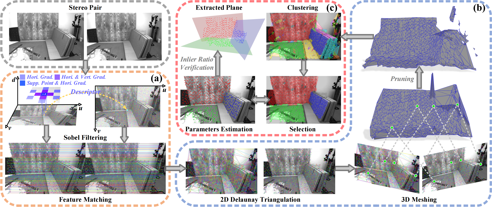

# RSS: Robust Stereo SLAM with Novel Extraction and Full Exploitation of Plane Features

## Introduction

This is the open-source version of the plane extraction algorithm of **RSS** (RA-L 2024), a novel point-plane-based stereo SLAM system, which is fully regularized by plane features within a unified non-linear optimization framework. The core of our system is an accurate and efficient stereo plane extraction algorithm with strict 2D and 3D outlier rejection mechanisms, effectively extracting main planes from robust stereo correspondences and enabling real-time point-plane association. This plane extraction algorithm is the foundation of our novel optimization formulation that fully exploits plane constraints to enhance the performance of SLAM systems. The code will be available soon.

    

